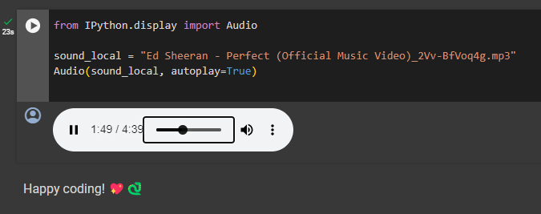

# Perfect


Is about loving **Free and open-source software** ([FOSS](https://en.wikipedia.org/wiki/Free_and_open-source_software)) Projects like [Python](https://www.python.org/) 💖🐍

[](https://colab.research.google.com/github/oleksis/perfect-jupyter/blob/main/Perfect.ipynb)

## Screenshots



## Motivation

You dont need download a media (audio/video) just fork the repo, play with Jupyter Notebook using @code and share a song with a Pull Request

We can create a Playlist from the Community using GitHub

Happy coding! 💖🐍

## Share

- Twitter / X

```txt
🎧 Check out this amazing song: 🐍 https://youtu.be/V09fr_IaYis 

#ShareTheSong
```

## Playlist

Youtube

1. [🎵](https://www.youtube.com/playlist?list=PLKOe5c5VIUYVpgRImJCNZt_qETNqDIyZ4)
